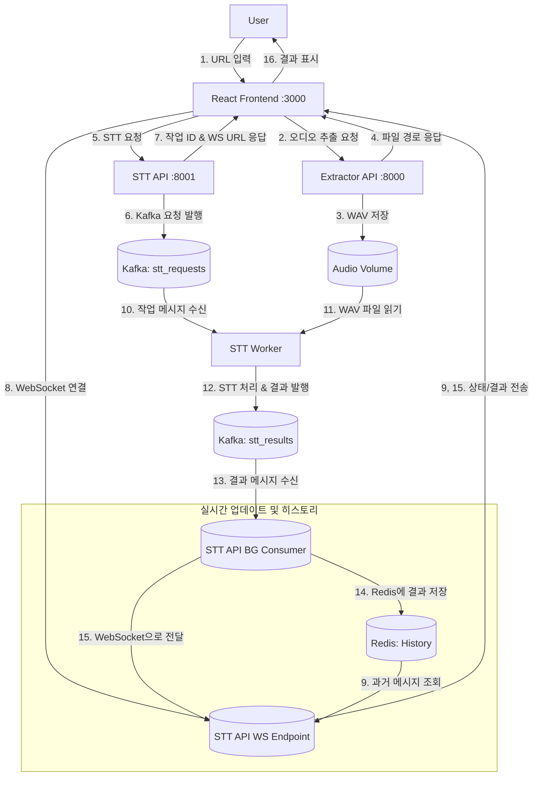

# YouTube 일본어 STT 및 번역 시스템

## 목차
1. [프로젝트 개요](#1-프로젝트-개요)
2. [시스템 아키텍처](#2-시스템-아키텍처)
3. [기술 스택](#3-기술-스택)
4. [주요 기능](#4-주요-기능-현재)
5. [설치 및 실행 방법](#5-설치-및-실행-방법)
6. [향후 계획: 번역 모델 서빙](#6-향후-계획-번역-모델-서빙-seldon-core)

## 1. 프로젝트 개요

본 프로젝트는 YouTube 비디오에서 일본어 음성을 추출하고, Speech-to-Text(STT) 기술을 활용해 텍스트로 변환한 후 최종적으로 한국어로 번역하는 통합 시스템입니다.

### 핵심 특징:

- **비동기 처리 파이프라인**: Apache Kafka를 이용한 메시지 큐 방식으로 긴 영상 처리 시 발생하는 사용자 대기 시간과 서버 부하 문제 최소화
- **실시간 진행 상황 모니터링**: WebSocket을 통해 처리 과정과 결과를 실시간으로 확인 가능
- **모듈화된 아키텍처**: 각 기능(추출, STT, 번역)이 독립적으로 작동하여 확장성과 유지보수성 향상

현재는 일본어 STT 기능과 실시간 결과 확인을 위한 백엔드 파이프라인, 그리고 React 기반 프론트엔드 클라이언트까지 구현되어 있습니다.

## 2. 시스템 아키텍처

시스템 전체 흐름도:




### 시스템 흐름 설명:

1. **사용자 요청 및 오디오 추출**:
   - 사용자가 YouTube URL을 입력하면 리액트 클라이언트가 유튜브 추출기 서비스로 요청 전송
   - 추출기 서비스는 해당 영상에서 오디오를 추출하여 WAV 파일로 저장하고 파일 경로 반환

2. **STT 작업 처리**:
   - 클라이언트는 추출된 오디오 파일 경로로 STT API에 작업 요청
   - STT API는 고유 작업 ID를 생성하고 Kafka의 `stt_requests` 토픽에 작업 발행
   - STT producer는 Kafka에서 작업을 받아 오디오를 청크 단위로 분할하고 STT 처리

3. **실시간 결과 전송**:
   - producer는 처리 진행률과 결과를 Kafka의 `stt_results` 토픽에 발행
   - API 서비스의 백그라운드 consumer가 결과를 수신하여 웹소켓을 통해 클라이언트로 전송
   - 동시에 Redis에 메시지 히스토리 저장 (늦은 접속 클라이언트 지원)

4. **향후 번역 기능 (예정)**:
   - STT 처리된 일본어 텍스트는 번역 서비스로 전달
   - 번역 서비스는 Seldon Core로 구축된 번역 모델에 요청하여 한국어로 변환
   - 번역 결과는 Kafka를 통해 웹소켓 관리자로 전달되어 클라이언트에게 실시간 제공

### 주요 구성 요소:

#### Frontend (`frontend`):
- React 기반 웹 애플리케이션
- YouTube URL 입력 및 결과 표시 인터페이스
- WebSocket을 통한 실시간 업데이트 수신

#### Backend Services (`backend/services`):

- **`youtube-extractor`**: 
  - YouTube URL에서 음성 추출 담당
  - FastAPI 기반 서비스
  - 추출된 WAV 파일을 공유 볼륨에 저장

- **`stt-processor-api`**: 
  - 사용자 요청 접수 및 작업 ID 발급
  - Kafka 토픽으로 작업 발행
  - WebSocket 연결 관리 및 실시간 결과 전송
  - Redis에 처리 결과 히스토리 저장

- **`stt-processor-worker`**:
  - Kafka Consumer로 작업 수신
  - 오디오 분할 및 STT 처리
  - 진행 상황과 결과를 Kafka로 발행

#### Infrastructure:
- **`Kafka` + `Zookeeper`**: 비동기 메시지 큐
- **`Redis`**: WebSocket 메시지 히스토리 저장소

## 3. 기술 스택

### Backend:
- **Python**: 주요 개발 언어
- **FastAPI**: 고성능 비동기 API 서버 및 WebSocket 서버
- **Apache Kafka**: 비동기 메시지 큐
- **Redis**: 인메모리 데이터 저장
- **Faster-Whisper**: STT 모델
- **Pydub**: 오디오 파일 처리

### Frontend:
- **React**: UI 컴포넌트 관리
- **JavaScript (ES6+)**: 프론트엔드 로직
- **WebSocket API**: 실시간 업데이트 수신
- **Axios/Fetch API**: HTTP 요청 처리

### Infrastructure:
- **Docker/Docker Compose**: 컨테이너화 및 서비스 오케스트레이션
- **Git/GitHub**: 버전 관리 및 협업

## 4. 주요 기능 (현재)

- YouTube URL에서 일본어 오디오 추출
- Kafka 기반 비동기 STT 작업 처리
- 오디오 자동 분할 및 청크 단위 STT 처리
- WebSocket을 통한 실시간 진행률 및 결과 전송
- 타임스탬프가 포함된 텍스트 세그먼트 제공
- Redis 기반 메시지 히스토리 관리
- 직관적인 웹 인터페이스

## 5. 설치 및 실행 방법

### 사전 요구 사항:
- [Docker](https://www.docker.com/products/docker-desktop/) 및 [Docker Compose](https://docs.docker.com/compose/install/)
- [Node.js](https://nodejs.org/) 및 [npm](https://www.npmjs.com/)/[yarn](https://yarnpkg.com/)

### 백엔드 실행:
```bash
# 백엔드 디렉토리로 이동
cd backend

# Docker 이미지 빌드 (최초 실행 시 또는 변경사항 있을 때)
docker-compose build

# 주의사항: docker desktop을 끄거나 서버를 껐을 경우, 해당 명령어를 필수적으로 입력해주십시오. (웹소켓 꼬임 현상, 향후 해결 필요)
docker-compose down -v

# 모든 백엔드 서비스 시작
docker-compose up -d

# 로그 확인 (선택사항)
docker-compose logs -f
```

### 프론트엔드 실행:
```bash
# 프론트엔드 디렉토리로 이동
cd frontend

# 필요한 패키지 설치 (최초 실행 시)
npm install
# 또는
yarn install

# 개발 서버 실행
npm start
# 또는
yarn start
```

### 환경 설정 (선택사항):
`frontend` 디렉토리에 `.env` 파일을 생성하여 API 주소 설정:
```
REACT_APP_EXTRACTOR_API_URL=http://127.0.0.1:8000
REACT_APP_STT_API_URL=http://127.0.0.1:8001
REACT_APP_WS_BASE_URL=ws://127.0.0.1:8001
```

### 애플리케이션 사용:
1. 웹 브라우저에서 `http://localhost:3000` 접속
2. YouTube URL 입력
3. "Start Transcription" 버튼 클릭
4. 실시간으로 처리 과정 및 결과 확인

## 6. 향후 계획: 번역 모델 서빙 (Seldon Core)

STT 기능에 이어 일본어에서 한국어로의 번역 기능을 추가할 예정입니다. 이를 위해 Seldon Core를 활용한 모델 서빙 전략을 도입할 계획입니다.

### Seldon Core 도입 로드맵:

1. **번역 모델 선택/학습**: 일본어-한국어 번역에 적합한 모델 준비
2. **Python Wrapper 개발**: Seldon Core와 통합을 위한 인터페이스 구현
3. **모델 아티팩트 관리**: 클라우드 스토리지 또는 쿠버네티스 PV에 모델 저장
4. **추론 서버 이미지 빌드**: Docker 이미지로 패키징
5. **쿠버네티스 환경 구성**: 모델 서빙을 위한 인프라 준비
6. **Seldon Core 설치 및 배포**: 모델 서빙 플랫폼 구축
7. **백엔드 연동**: STT 결과를 번역 서비스와 연결

### Seldon Core 선택 이유:

- **확장성**: 트래픽에 따른 자동 스케일링
- **고급 배포 전략**: A/B 테스트, 카나리 배포 지원
- **모니터링 및 로깅**: 상세한 메트릭과 로그 제공
- **MLOps 통합**: 표준화된 모델 서빙 방식

---

© 2025 YouTube 일본어 STT 및 번역 시스템