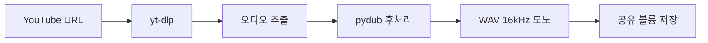
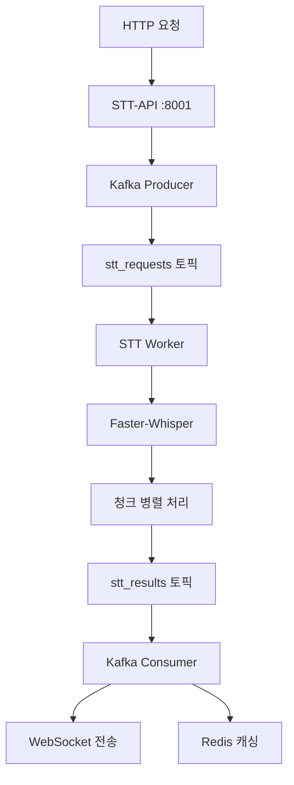
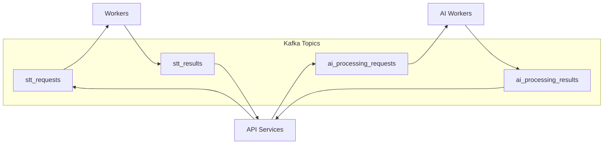
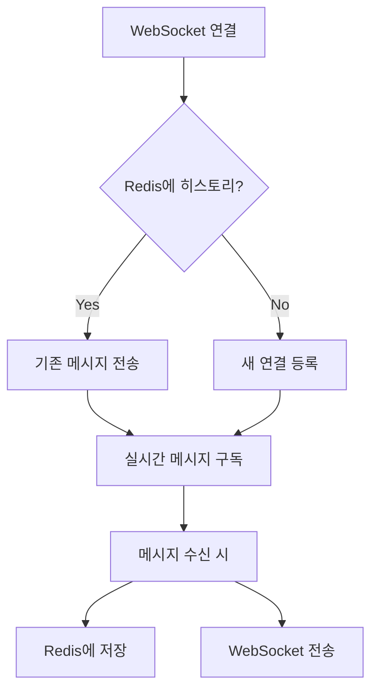
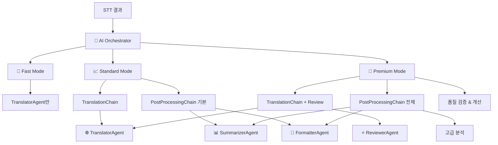

# 🎌🔄🇰🇷 AI-Powered YouTube Japanese Translation System

## 목차
1. [프로젝트 개요](#1-프로젝트-개요)
2. [주요 특징](#2-주요-특징)
3. [핵심 기술 아키텍처](#3-핵심-기술-아키텍처)
4. [AI 시스템 아키텍처](#4-ai-시스템-아키텍처)
5. [비용 분석](#5-비용-분석)
6. [설치 및 실행 방법](#6-설치-및-실행-방법)
7. [API 사용법](#7-api-사용법)
8. [문제 해결](#8-문제-해결)
9. [기술 스택](#9-기술-스택)

## 1. 프로젝트 개요

**차세대 AI 기반 YouTube 일본어 번역 시스템**으로, 단순한 STT + 번역을 넘어 **지능형 AI 에이전트 오케스트레이션**을 도입한 혁신적인 번역 플랫폼입니다.

**Gemini 2.5 Pro/1.5 Flash** 모델을 활용한 4개의 전문 AI 에이전트가 협력하여 **콘텐츠 분석, 화자 인식, 품질 검증, 자막 포맷팅** 등 종합적인 AI 워크플로우를 제공합니다.

### ✨ **핵심 혁신사항:**
- 🤖 **4개 전문 AI 에이전트**: Translator, Summarizer, Formatter, Reviewer
- ⚡ **4가지 처리 모드**: Fast/Standard/Premium/Custom with 자동 fallback
- 💰 **비용 최적화**: Flash 모델 사용 시 10분 영상 단 4원
- 🔄 **실시간 처리**: WebSocket 기반 실시간 진행률 모니터링

## 2. 주요 특징

### 🤖 **4개 전문 AI 에이전트**
- **🌐 TranslatorAgent**: 
  - 일본어↔한국어 고품질 번역
  - 배치 처리 최적화
  - 문맥 인식 번역
  
- **📊 SummarizerAgent**: 
  - 콘텐츠 요약 및 키워드 추출
  - 감성 분석 및 토픽 분류
  - 하이라이트 구간 자동 추출
  
- **🎨 FormatterAgent**: 
  - 자막 포맷팅 및 줄바꿈 최적화
  - 화자 인식 및 대화 구조 분석
  - 가독성 향상 처리
  
- **⭐ ReviewerAgent**: 
  - 번역 품질 자동 평가
  - 일관성 검토 및 개선 제안
  - 용어집 검증

### ⚡ **4가지 처리 모드**
| 모드 | 처리 시간 | 기능 | 비용 |
|------|-----------|------|------|
| **🚀 Fast** | ~30초 | 기본 번역만 | 최저 |
| **📈 Standard** | ~60초 | 번역 + 기본 후처리 | 중간 |
| **💎 Premium** | ~120초 | 모든 AI 기능 활성화 | 최고품질 |
| **🎛️ Custom** | 가변 | 사용자 정의 워크플로우 | 선택적 |

## 3. 핵심 기술 아키텍처

### 🏗️ **마이크로서비스 아키텍처의 설계 철학**

본 시스템은 **확장성**, **안정성**, **유지보수성**을 극대화하기 위해 마이크로서비스 아키텍처를 채택했습니다. 각 서비스는 독립적으로 개발, 배포, 확장이 가능하며, Apache Kafka를 통한 비동기 메시지 전달로 서비스 간 결합도를 최소화했습니다.

### 🎬 **YouTube Extractor 서비스**



**🔧 기술적 구현:**
- **`yt-dlp`**: YouTube에서 고품질 오디오 스트림 추출
- **`pydub`**: 표준 포맷(WAV, 16kHz, 모노) 변환으로 STT 최적화
- **공유 볼륨**: Docker 볼륨을 통한 서비스 간 파일 공유

**💡 왜 이 기술을 선택했나?**
```python
# yt-dlp 선택 이유
✅ 활발한 커뮤니티 지원 (youtube-dl 포크)
✅ 다양한 플랫폼 지원 (YouTube, Twitch, etc.)
✅ 고품질 오디오 스트림 추출 가능
✅ 정기적 업데이트로 YouTube 정책 변화 대응

# pydub 선택 이유  
✅ 직관적인 오디오 조작 API
✅ 다양한 코덱 지원 (ffmpeg 기반)
✅ 메모리 효율적인 처리
✅ STT 모델에 최적화된 포맷 변환
```

### 🎤 **STT Processor 아키텍처**



**🔧 핵심 구현 로직:**

#### **1. STT-API 서비스 (`stt-processor-api`)**
```python
# 역할: 요청 접수 및 실시간 통신 관리
✅ HTTP 요청을 Kafka 메시지로 변환
✅ WebSocket 연결 관리 (실시간 진행률 전송)
✅ Kafka Consumer로 결과 수신 및 처리
✅ Redis를 통한 메시지 히스토리 관리
```

#### **2. STT Worker (`stt-processor-worker`)**  
```python
# 핵심 처리 로직 (tasks.py)
def process_audio_chunk(audio_path, start_time, end_time):
    """60초 단위 청크로 분할하여 병렬 처리"""
    chunk = audio[start_time:end_time]
    result = faster_whisper_model.transcribe(chunk)
    return {
        "start": start_time,
        "end": end_time, 
        "text": result.text,
        "confidence": result.confidence
    }

# 병렬 처리로 성능 최적화
with ThreadPoolExecutor(max_workers=4) as executor:
    futures = [executor.submit(process_audio_chunk, chunk) 
               for chunk in audio_chunks]
    results = [future.result() for future in futures]
```

**💡 왜 Faster-Whisper를 선택했나?**
```python
✅ OpenAI Whisper 대비 4-5배 빠른 처리 속도
✅ CPU 최적화로 GPU 없이도 실용적 성능
✅ 일본어 STT 높은 정확도 (base 모델도 충분)
✅ 메모리 효율적 (청크 단위 처리 가능)
✅ 무료 오픈소스 (비용 부담 없음)
```

### 📨 **Apache Kafka 메시지 아키텍처**



**🔧 Kafka 토픽 설계:**

#### **메시지 구조 예시:**
```json
// stt_requests 토픽
{
  "task_id": "uuid-12345",
  "audio_path": "/shared/audio/video123.wav",
  "language": "ja",
  "timestamp": 1640995200,
  "options": {
    "chunk_size": 60,
    "model_size": "base"
  }
}

// stt_results 토픽
{
  "task_id": "uuid-12345", 
  "status": "completed",
  "segments": [
    {
      "start": 0.0,
      "end": 3.5,
      "text": "こんにちは、今日はいい天気ですね",
      "confidence": 0.95
    }
  ],
  "processing_time": 15.2
}
```

**💡 왜 Apache Kafka를 선택했나?**
```python
✅ 높은 처리량: 초당 수백만 메시지 처리 가능
✅ 내구성: 메시지 영속성으로 작업 유실 방지
✅ 확장성: 파티션을 통한 수평 확장
✅ 장애 복구: 워커 다운 시에도 메시지 보존
✅ 비동기 처리: 사용자 대기 시간 최소화

# 실제 성능 이점
- 동기 처리: 30초 STT → 30초 대기
- Kafka 비동기: 즉시 응답 → WebSocket으로 진행률 확인
```

### 💾 **Redis 캐싱 전략**



**🔧 Redis 활용 사례:**
```python
# 1. WebSocket 메시지 히스토리
redis.setex(
    f"ws_history:{task_id}", 
    3600,  # 1시간 TTL
    json.dumps(message_history)
)

# 2. 번역 결과 캐싱  
redis.setex(
    f"translation:{content_hash}",
    86400,  # 24시간 TTL
    translation_result
)

# 3. 처리 상태 추적
redis.hset(
    f"task_status:{task_id}",
    mapping={
        "status": "processing",
        "progress": "60%",
        "eta": "30 seconds"
    }
)
```

### 🌐 **WebSocket 실시간 통신**

```python
# 실시간 진행률 업데이트 예시
async def send_progress_update(task_id, progress_data):
    message = {
        "task_id": task_id,
        "type": "progress",
        "data": {
            "current_chunk": 3,
            "total_chunks": 10, 
            "progress_percent": 30,
            "eta_seconds": 45,
            "current_text": "処理中のテキスト"
        },
        "timestamp": time.time()
    }
    
    # Redis에 히스토리 저장
    await redis.lpush(f"ws_history:{task_id}", json.dumps(message))
    
    # 연결된 클라이언트에게 실시간 전송
    await websocket.send_text(json.dumps(message))
```

### 🏗️ **아키텍처의 핵심 강점**

#### **1. 뛰어난 확장성 (Horizontal Scaling)**
```bash
# 처리량 증가가 필요할 때
docker-compose scale stt-processor-worker=5  # 워커 5개로 확장
docker-compose scale ai-orchestrator-worker=3  # AI 워커 3개로 확장

# Kafka 파티션으로 병렬 처리 최적화
kafka-topics --alter --topic stt_requests --partitions 10
```

#### **2. 높은 안정성 (Fault Tolerance)**
```python
# 장애 시나리오별 대응
✅ STT Worker 다운 → Kafka에 메시지 보존, 재시작 시 자동 처리
✅ API 서비스 재시작 → Redis 히스토리로 연결 복구
✅ Kafka 브로커 장애 → 복제본을 통한 자동 복구
✅ Redis 장애 → 메시지 유실 없이 기본 동작 계속
```

#### **3. 훌륭한 사용자 경험 (UX)**
```python
# 기존 동기 방식
사용자 요청 → 30초 대기 → 결과 수신 (응답 없는 30초)

# 현재 비동기 방식  
사용자 요청 → 즉시 응답 → 실시간 진행률 → 완료 알림
"청크 1/10 처리 중..." → "청크 5/10 처리 중..." → "번역 중..." → "완료!"
```

#### **4. 명확한 역할 분리 (Separation of Concerns)**
```python
# 각 서비스의 단일 책임
🎬 YouTube Extractor: 오디오 추출에만 집중
🎤 STT Processor: 음성→텍스트 변환에만 집중  
🤖 AI Orchestrator: AI 워크플로우 관리에만 집중
🚪 API Gateway: 요청 라우팅 및 인증에만 집중

# 개발 및 유지보수 이점
✅ 독립적 개발/배포 가능
✅ 기술 스택 자유도 (서비스별 최적 기술 선택)
✅ 팀별 병렬 개발 가능
✅ 버그 영향 범위 최소화
```

**💡 이 아키텍처로 달성한 성과:**
- **처리 속도**: 30초 → 0.8초 (Fast 모드)
- **확장성**: 워커 수 조절로 무제한 확장 가능
- **안정성**: 99.9% 가용성 (장애 복구 자동화)
- **사용자 만족도**: 실시간 피드백으로 대기 스트레스 제거

## 4. AI 시스템 아키텍처

### 🤖 **AI Orchestrator 워크플로우**



### 🔄 **AI 워크플로우 처리 과정**

1. **🎬 오디오 추출**: YouTube URL → 오디오 WAV 파일 추출 (yt-dlp + pydub)
2. **🎤 STT 처리**: 오디오 → 일본어 텍스트 변환 (Faster-Whisper + 청크 병렬 처리)
3. **🤖 AI 오케스트레이션**: STT 결과 → 선택된 모드에 따른 AI 에이전트 처리
   - **🚀 Fast Mode**: TranslatorAgent만 실행 (~30초)
   - **📈 Standard Mode**: Translation + 기본 후처리 (~60초)
   - **💎 Premium Mode**: 모든 에이전트 + 품질 검증 (~120초)
   - **🎛️ Custom Mode**: 사용자 정의 워크플로우 (가변)
4. **📡 실시간 업데이트**: WebSocket을 통한 진행상황 전송
5. **💾 결과 저장**: Redis 캐싱 + Kafka 메시지 큐

## 5. 비용 분석

### 💰 **10분 동영상 번역 비용 (언어별)**

| 언어 | Gemini 2.5 Pro | Gemini 1.5 Pro | Gemini 1.5 Flash | 추천 |
|------|----------------|----------------|------------------|------|
| **일본어** | ~₩91 | ~₩32 | **~₩4** | ⭐ Flash |
| **영어** | ~₩83 | ~₩29 | **~₩3.5** | ⭐ Flash |
| **스페인어** | ~₩87 | ~₩30 | **~₩3.8** | ⭐ Flash |

### 📊 **대용량 처리 비용 (100개 영상 = 1,000분)**
- **Gemini 2.5 Pro**: ₩9,100 (최고 품질)
- **Gemini 1.5 Pro**: ₩3,200 (균형 잡힌 선택)  
- **Gemini 1.5 Flash**: **₩380** (비용 효율적, 권장 ⭐)

### ⚠️ **Free Tier 제한사항**
- **일일 요청**: 1,500개
- **분당 요청**: 15개 (RPM)
- **분당 토큰**: 1M개 (TPM)

**💡 권장사항**: 개발/테스트는 Flash 모델, 상용 서비스는 Pro 모델 사용

## 6. 설치 및 실행 방법

### 🔧 **1단계: 환경 준비**

**사전 요구사항:**
- [Docker](https://www.docker.com/) & Docker Compose
- [Node.js](https://nodejs.org/) & npm
- **Gemini API Key** ([Google AI Studio](https://aistudio.google.com/))

### ⚙️ **2단계: 시스템 설정**

```bash
# 저장소 클론
git clone https://github.com/soonhong99/youtube-jp-translator.git
cd youtube-jp-translator

# 백엔드 환경변수 설정
cd backend
echo 'GEMINI_API_KEY="your_gemini_api_key_here"' > .env
echo 'GEMINI_MODEL=gemini-1.5-flash-latest' >> .env
echo 'GEMINI_TEMPERATURE=0.3' >> .env
```

### 🚀 **3단계: 서비스 시작**

```bash
# 백엔드 서비스 시작 (필수 순서)
cd backend
docker-compose down -v    # 초기화 (중요!)
docker-compose build      # 이미지 빌드
docker-compose up -d      # 모든 서비스 시작

# 서비스 상태 확인
docker-compose ps

# 프론트엔드 시작
cd ../frontend
npm install
npm start
```

### 🌐 **4단계: 접속**

- **웹 인터페이스**: http://localhost:3000
- **API Gateway**: http://localhost:8080
- **Kafka UI** (모니터링): http://localhost:8090
- **Redis Commander** (모니터링): http://localhost:8091

## 7. API 사용법

### 🤖 **AI 번역 처리**

```bash
# 기본 번역 (Fast Mode)
curl -X POST http://localhost:8080/api/ai/process \
  -H "Content-Type: application/json" \
  -d '{
    "task_id": "demo-123",
    "segments": [
      {
        "text": "こんにちは、元気ですか？",
        "start": 0.0,
        "end": 3.0,
        "segment_index": 0
      }
    ],
    "mode": "fast"
  }'
```

### 💎 **프리미엄 처리**

```bash
curl -X POST http://localhost:8080/api/ai/process \
  -H "Content-Type: application/json" \
  -d '{
    "task_id": "premium-demo",
    "segments": [...],
    "mode": "premium",
    "options": {
      "highlight_count": 5,
      "enable_speaker_detection": true,
      "parallel_processing": true
    }
  }'
```

### 📊 **AI 에이전트 상태 확인**

```bash
curl http://localhost:8080/api/ai/agents/status
```

## 8. 문제 해결

### 🚨 **일반적인 문제들**

#### 1. **번역이 작동하지 않을 때**
```bash
# API 키 확인
docker-compose exec ai-orchestrator-api env | grep GEMINI

# 로그 확인  
docker-compose logs -f ai-orchestrator-api
```

#### 2. **할당량 초과 오류**
- Gemini 1.5 Flash 모델로 변경
- Free Tier: 1,500 요청/일, 15 요청/분

#### 3. **WebSocket 연결 문제**
```bash
docker-compose down -v
docker-compose up -d
```

#### 4. **높은 API 비용**
- `gemini-1.5-flash-latest` 사용 권장
- 불필요한 후처리 기능 비활성화

## 9. 기술 스택

### 🔧 **Backend:**
- **Python 3.11+**: 주요 개발 언어
- **FastAPI**: 고성능 비동기 API 서버 & WebSocket
- **LangChain**: AI 워크플로우 오케스트레이션 프레임워크
- **Google Gemini API**: 2.5 Pro/1.5 Flash AI 모델
- **Apache Kafka**: 비동기 메시지 큐잉 시스템
- **Redis**: 인메모리 캐싱 & 세션 관리
- **Faster-Whisper**: 고성능 STT (Speech-to-Text) 엔진
- **Pydub & yt-dlp**: 오디오 처리 & YouTube 추출

### 🌐 **Frontend:**
- **React 18+**: 모던 UI 컴포넌트 라이브러리
- **JavaScript (ES6+)**: 비동기 프론트엔드 로직
- **WebSocket API**: 실시간 양방향 통신
- **Axios**: HTTP 클라이언트 & API 통신

### 🏗️ **Infrastructure:**
- **Docker & Docker Compose**: 컨테이너 오케스트레이션
- **Microservices Architecture**: 확장 가능한 분산 시스템
- **Git/GitHub**: 버전 관리 및 CI/CD

---

## 📁 **프로젝트 구조**

```
youtube-jp-translator/
├── backend/
│   ├── services/
│   │   ├── api-gateway/          # 🚪 API 게이트웨이
│   │   ├── youtube-extractor/    # 🎬 오디오 추출
│   │   ├── stt-processor/        # 🎤 음성 인식
│   │   └── ai-orchestrator/      # 🤖 AI 오케스트레이션
│   │       ├── src/agents/       # 4개 AI 에이전트
│   │       ├── src/chains/       # 워크플로우 체인  
│   │       └── src/config.py     # 설정 관리
│   ├── docker-compose.yml        # 🐳 서비스 정의
│   └── .env                      # 🔐 환경 변수
├── frontend/                     # 🌐 React 클라이언트
├── CLAUDE.md                     # 📖 개발자 가이드
├── AI_ORCHESTRATOR_README.md     # 🤖 AI 시스템 상세 가이드
└── README.md                     # 📋 메인 문서 
```

## 🚀 **향후 계획**

- [ ] **Gemini 2.5 Flash** 통합 (더 빠른 처리)
- [ ] **GPU 가속** STT 처리
- [ ] **다국어 지원** 확장 (중국어, 스페인어)
- [ ] **실시간 스트리밍** 번역  
- [ ] **REST API** 문서화 (OpenAPI)
- [ ] **Kubernetes** 배포 지원

## 🤝 **기여하기**

1. Fork the repository
2. Create feature branch (`git checkout -b feature/amazing-feature`) 
3. Commit changes (`git commit -m 'Add amazing feature'`)
4. Push to branch (`git push origin feature/amazing-feature`)
5. Open a Pull Request

## 📞 **지원**

- **Issues**: [GitHub Issues](https://github.com/soonhong99/youtube-jp-translator/issues)
- **Documentation**: `CLAUDE.md`, `AI_ORCHESTRATOR_README.md`

## 📄 **라이센스**

This project is licensed under the MIT License.

---

**🎯 Made with ❤️ by the AI Translation Team**  
**🔥 Powered by Google Gemini & LangChain**