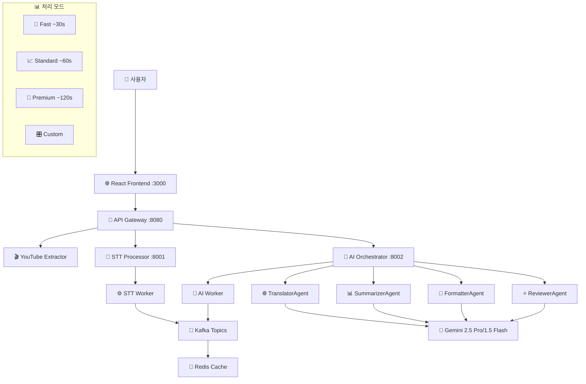

# 🎌🔄🇰🇷 AI-Powered YouTube Japanese Translation System

## 목차
1. [프로젝트 개요](#1-프로젝트-개요)
2. [주요 특징](#2-주요-특징)
3. [시스템 아키텍처](#3-시스템-아키텍처)
4. [비용 분석](#4-비용-분석)
5. [설치 및 실행 방법](#5-설치-및-실행-방법)
6. [API 사용법](#6-api-사용법)
7. [문제 해결](#7-문제-해결)
8. [기술 스택](#8-기술-스택)

## 1. 프로젝트 개요

**차세대 AI 기반 YouTube 일본어 번역 시스템**으로, 단순한 STT + 번역을 넘어 **지능형 AI 에이전트 오케스트레이션**을 도입한 혁신적인 번역 플랫폼입니다.

**Gemini 2.5 Pro/1.5 Flash** 모델을 활용한 4개의 전문 AI 에이전트가 협력하여 **콘텐츠 분석, 화자 인식, 품질 검증, 자막 포맷팅** 등 종합적인 AI 워크플로우를 제공합니다.

### ✨ **핵심 혁신사항:**
- 🤖 **4개 전문 AI 에이전트**: Translator, Summarizer, Formatter, Reviewer
- ⚡ **4가지 처리 모드**: Fast/Standard/Premium/Custom with 자동 fallback
- 💰 **비용 최적화**: Flash 모델 사용 시 10분 영상 단 4원
- 🔄 **실시간 처리**: WebSocket 기반 실시간 진행률 모니터링

## 2. 주요 특징

### 🤖 **4개 전문 AI 에이전트**
- **🌐 TranslatorAgent**: 
  - 일본어↔한국어 고품질 번역
  - 배치 처리 최적화
  - 문맥 인식 번역
  
- **📊 SummarizerAgent**: 
  - 콘텐츠 요약 및 키워드 추출
  - 감성 분석 및 토픽 분류
  - 하이라이트 구간 자동 추출
  
- **🎨 FormatterAgent**: 
  - 자막 포맷팅 및 줄바꿈 최적화
  - 화자 인식 및 대화 구조 분석
  - 가독성 향상 처리
  
- **⭐ ReviewerAgent**: 
  - 번역 품질 자동 평가
  - 일관성 검토 및 개선 제안
  - 용어집 검증

### ⚡ **4가지 처리 모드**
| 모드 | 처리 시간 | 기능 | 비용 |
|------|-----------|------|------|
| **🚀 Fast** | ~30초 | 기본 번역만 | 최저 |
| **📈 Standard** | ~60초 | 번역 + 기본 후처리 | 중간 |
| **💎 Premium** | ~120초 | 모든 AI 기능 활성화 | 최고품질 |
| **🎛️ Custom** | 가변 | 사용자 정의 워크플로우 | 선택적 |

## 3. 시스템 아키텍처



1. **🎬 오디오 추출**: YouTube URL → 오디오 WAV 파일 추출
2. **🎤 STT 처리**: 오디오 → 일본어 텍스트 변환 (Faster-Whisper)
3. **🤖 AI 오케스트레이션**: STT 결과 → AI 에이전트 처리
   - **🚀 Fast Mode**: TranslatorAgent만 실행
   - **📈 Standard Mode**: Translation + 기본 후처리
   - **💎 Premium Mode**: 모든 에이전트 + 품질 검증
   - **🎛️ Custom Mode**: 사용자 정의 워크플로우
4. **📡 실시간 업데이트**: WebSocket을 통한 진행상황 전송
5. **💾 결과 저장**: Redis 캐싱 + Kafka 메시지 큐

## 4. 비용 분석

### 💰 **10분 동영상 번역 비용 (언어별)**

| 언어 | Gemini 2.5 Pro | Gemini 1.5 Pro | Gemini 1.5 Flash | 추천 |
|------|----------------|----------------|------------------|------|
| **일본어** | ~₩91 | ~₩32 | **~₩4** | ⭐ Flash |
| **영어** | ~₩83 | ~₩29 | **~₩3.5** | ⭐ Flash |
| **스페인어** | ~₩87 | ~₩30 | **~₩3.8** | ⭐ Flash |

### 📊 **대용량 처리 비용 (100개 영상 = 1,000분)**
- **Gemini 2.5 Pro**: ₩9,100 (최고 품질)
- **Gemini 1.5 Pro**: ₩3,200 (균형 잡힌 선택)  
- **Gemini 1.5 Flash**: **₩380** (비용 효율적, 권장 ⭐)

### ⚠️ **Free Tier 제한사항**
- **일일 요청**: 1,500개
- **분당 요청**: 15개 (RPM)
- **분당 토큰**: 1M개 (TPM)

**💡 권장사항**: 개발/테스트는 Flash 모델, 상용 서비스는 Pro 모델 사용

## 5. 설치 및 실행 방법

### 🔧 **1단계: 환경 준비**

**사전 요구사항:**
- [Docker](https://www.docker.com/) & Docker Compose
- [Node.js](https://nodejs.org/) & npm
- **Gemini API Key** ([Google AI Studio](https://aistudio.google.com/))

### ⚙️ **2단계: 시스템 설정**

```bash
# 저장소 클론
git clone https://github.com/soonhong99/youtube-jp-translator.git
cd youtube-jp-translator

# 백엔드 환경변수 설정
cd backend
echo 'GEMINI_API_KEY="your_gemini_api_key_here"' > .env
echo 'GEMINI_MODEL=gemini-1.5-flash-latest' >> .env
echo 'GEMINI_TEMPERATURE=0.3' >> .env
```

### 🚀 **3단계: 서비스 시작**

```bash
# 백엔드 서비스 시작 (필수 순서)
cd backend
docker-compose down -v    # 초기화 (중요!)
docker-compose build      # 이미지 빌드
docker-compose up -d      # 모든 서비스 시작

# 서비스 상태 확인
docker-compose ps

# 프론트엔드 시작
cd ../frontend
npm install
npm start
```

### 🌐 **4단계: 접속**

- **웹 인터페이스**: http://localhost:3000
- **API Gateway**: http://localhost:8080
- **Kafka UI** (모니터링): http://localhost:8090
- **Redis Commander** (모니터링): http://localhost:8091

## 6. API 사용법

### 🤖 **AI 번역 처리**

```bash
# 기본 번역 (Fast Mode)
curl -X POST http://localhost:8080/api/ai/process \
  -H "Content-Type: application/json" \
  -d '{
    "task_id": "demo-123",
    "segments": [
      {
        "text": "こんにちは、元気ですか？",
        "start": 0.0,
        "end": 3.0,
        "segment_index": 0
      }
    ],
    "mode": "fast"
  }'
```

### 💎 **프리미엄 처리**

```bash
curl -X POST http://localhost:8080/api/ai/process \
  -H "Content-Type: application/json" \
  -d '{
    "task_id": "premium-demo",
    "segments": [...],
    "mode": "premium",
    "options": {
      "highlight_count": 5,
      "enable_speaker_detection": true,
      "parallel_processing": true
    }
  }'
```

### 📊 **AI 에이전트 상태 확인**

```bash
curl http://localhost:8080/api/ai/agents/status
```

## 7. 문제 해결

### 🚨 **일반적인 문제들**

#### 1. **번역이 작동하지 않을 때**
```bash
# API 키 확인
docker-compose exec ai-orchestrator-api env | grep GEMINI

# 로그 확인  
docker-compose logs -f ai-orchestrator-api
```

#### 2. **할당량 초과 오류**
- Gemini 1.5 Flash 모델로 변경
- Free Tier: 1,500 요청/일, 15 요청/분

#### 3. **WebSocket 연결 문제**
```bash
docker-compose down -v
docker-compose up -d
```

#### 4. **높은 API 비용**
- `gemini-1.5-flash-latest` 사용 권장
- 불필요한 후처리 기능 비활성화

## 8. 기술 스택

### 🔧 **Backend:**
- **Python 3.11+**: 주요 개발 언어
- **FastAPI**: 고성능 비동기 API 서버 & WebSocket
- **LangChain**: AI 워크플로우 오케스트레이션 프레임워크
- **Google Gemini API**: 2.5 Pro/1.5 Flash AI 모델
- **Apache Kafka**: 비동기 메시지 큐잉 시스템
- **Redis**: 인메모리 캐싱 & 세션 관리
- **Faster-Whisper**: 고성능 STT (Speech-to-Text) 엔진
- **Pydub & yt-dlp**: 오디오 처리 & YouTube 추출

### 🌐 **Frontend:**
- **React 18+**: 모던 UI 컴포넌트 라이브러리
- **JavaScript (ES6+)**: 비동기 프론트엔드 로직
- **WebSocket API**: 실시간 양방향 통신
- **Axios**: HTTP 클라이언트 & API 통신

### 🏗️ **Infrastructure:**
- **Docker & Docker Compose**: 컨테이너 오케스트레이션
- **Microservices Architecture**: 확장 가능한 분산 시스템
- **Git/GitHub**: 버전 관리 및 CI/CD

---

## 📁 **프로젝트 구조**

```
youtube-jp-translator/
├── backend/
│   ├── services/
│   │   ├── api-gateway/          # 🚪 API 게이트웨이
│   │   ├── youtube-extractor/    # 🎬 오디오 추출
│   │   ├── stt-processor/        # 🎤 음성 인식
│   │   └── ai-orchestrator/      # 🤖 AI 오케스트레이션
│   │       ├── src/agents/       # 4개 AI 에이전트
│   │       ├── src/chains/       # 워크플로우 체인  
│   │       └── src/config.py     # 설정 관리
│   ├── docker-compose.yml        # 🐳 서비스 정의
│   └── .env                      # 🔐 환경 변수
├── frontend/                     # 🌐 React 클라이언트
├── CLAUDE.md                     # 📖 개발자 가이드
├── AI_ORCHESTRATOR_README.md     # 🤖 AI 시스템 상세 가이드
└── README.md                     # 📋 메인 문서 
```

## 🚀 **향후 계획**

- [ ] **Gemini 2.5 Flash** 통합 (더 빠른 처리)
- [ ] **GPU 가속** STT 처리
- [ ] **다국어 지원** 확장 (중국어, 스페인어)
- [ ] **실시간 스트리밍** 번역  
- [ ] **REST API** 문서화 (OpenAPI)
- [ ] **Kubernetes** 배포 지원

## 🤝 **기여하기**

1. Fork the repository
2. Create feature branch (`git checkout -b feature/amazing-feature`) 
3. Commit changes (`git commit -m 'Add amazing feature'`)
4. Push to branch (`git push origin feature/amazing-feature`)
5. Open a Pull Request

## 📞 **지원**

- **Issues**: [GitHub Issues](https://github.com/soonhong99/youtube-jp-translator/issues)
- **Documentation**: `CLAUDE.md`, `AI_ORCHESTRATOR_README.md`

## 📄 **라이센스**

This project is licensed under the MIT License.

---

**🎯 Made with ❤️ by the AI Translation Team**  
**🔥 Powered by Google Gemini & LangChain**